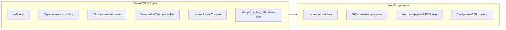
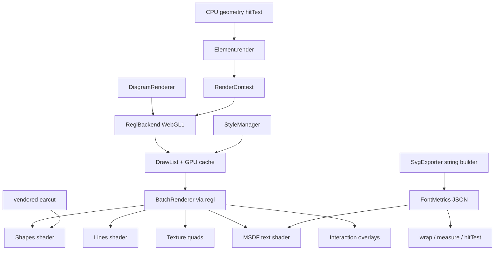

# Переход Papirus на WebGL

План миграции с Canvas 2D на WebGL через **regl**. Статус: **черновик**, реализация не начата.

## Зафиксированный стек зависимостей

| Компонент | Способ подключения | Лицензия | Зачем |
|-----------|-------------------|----------|-------|
| **regl** | npm runtime dep (`"regl": "^2.1.1"`) | MIT, 0 transitive | WebGL boilerplate: шейдеры, буферы, state, draw calls |
| **earcut** | **vendored** в `src/render/vendor/` | ISC | Triangulation concave paths (`CustomShapeNode`) |
| **msdf-bmfont** | npm **devDependency** | MIT | Build-time: `font-atlas.png` + `font-metrics.json` |
| MSDF shader, FontMetrics, RenderContext | свой код | — | GPU text, layout, draw API |

**Не используем:** Canvas 2D API, PixiJS, twgl.js.

**Для потребителя (wArchi):** papirus тянет **regl** как единственную новую runtime dependency.

### WebGL1 + regl (зафиксировано)

**regl — WebGL1-библиотека.** Официальной поддержки WebGL2 у regl нет; workaround с передачей `webgl2` context нестабилен (шейдеры, extensions).

**Решение:** целевой runtime — **WebGL1 через regl** (`canvas.getContext('webgl')` или контекст, который создаёт regl). Для 2D-диаграмм WebGL1 достаточно. Требование «WebGL2 only» из ранних черновиков **снято**.

**Fallback (не планируем):** raw `WebGL2RenderingContext` + свой `GlContext.ts`, если regl заблокируют по политике deps.

---

## Что такое vendored

**Vendored** — исходник библиотеки **скопирован в репозиторий**, а не установлен через npm.

```
src/render/vendor/
  earcut.ts          ← код Mapbox earcut v3.2.3 (~400 строк)
  earcut.LICENSE     ← ISC copyright + permission text
```

- В `package.json` **нет** `"earcut"`
- Обновления — вручную при необходимости
- Attribution: `NOTICE` (создать при старте реализации) + `earcut.LICENSE`
- Алгоритм идентичен npm-пакету; отличается только способ доставки

**Почему earcut vendored, а regl — npm:** earcut — один стабильный файл; regl удобнее обновлять через npm.

---

## Лицензии (кратко)

MIT/ISC **не ослабляют** AGPL на код Papirus. Коммерческая лицензия Papirus не затрагивается. Обязанность — copyright notices в `NOTICE` / `third-party-licenses.md`.

| Библиотека | Лицензия | В runtime dist |
|------------|----------|----------------|
| regl | MIT | да |
| earcut (vendored) | ISC | да (в bundle papirus) |
| msdf-bmfont | MIT | нет (только build) |

**PixiJS** — отклонён: +200 KB gzip, много deps, чужая scene graph.

**Зафиксировано:** zero Canvas 2D API, **WebGL1 + regl** + vendored earcut + MSDF build-time.

---

## Сторонние библиотеки: роли в плане

| Библиотека | Вердикт | Роль |
|------------|---------|------|
| **regl** | ✅ npm runtime | WebGL draw pipeline, context loss hooks |
| **earcut** | ✅ vendored | Fill concave paths + hitTest без `isPointInPath` |
| **msdf-bmfont** | ✅ devDep | Font atlas generation |
| **MSDF shader** | ✅ свой код | ~80 строк GLSL |
| **twgl.js** | ❌ | Заменён regl |
| **PixiJS** | ❌ | Overkill |

### regl — зачем берём

- Компиляция шейдеров, VBO, tracking GL state, декларативные draw calls
- **0 transitive deps**, MIT, ~30 KB gzip
- Меньше boilerplate vs raw `GlContext.ts`
- Не даёт extra GPU perf — только ergonomics разработки

### earcut — зачем vendored

- Ear-clipping для concave polygons с holes (`CustomShapeNode`: document, cylinder и т.д.)
- Convex shapes (rect, circle, diamond) — fan triangulation без earcut
- Vendored = zero npm dep для triangulation, attribution в NOTICE

### MSDF / GPU text (canvas исключён)

Canvas 2D для текста **не используем**.

**Build-time (devDependency, не в dist):**

- `msdf-bmfont` или `@msdfgen/msdf-bmfont` — генерирует `font-atlas.png` + `font-metrics.json`
- Скрипт: `npm run build:fonts` в prepublish

**Runtime (свой код):**

- `FontMetrics` — замена `ctx.measureText` / `wrapMeasuredText` ([`textMeasurer.ts`](../src/utils/textMeasurer.ts))
- `MsdfTextRenderer` — MSDF fragment shader, batched glyph quads
- Rotation edge labels — transform matrix в vertex shader

**SvgExporter:** string-builder **не трогаем**; только measure/layout переводим на `FontMetrics` (см. фазу 4).

### Шрифты v1 (scope, без регрессий для wArchi)

| Вариант | v1 | Примечание |
|---------|-----|------------|
| Latin + Cyrillic | ✅ | Обязательно |
| Outfit (wArchi UI font) | ✅ | Отдельная atlas page |
| `sans-serif` / default stack | ✅ | Основной atlas |
| **bold** / **italic** | ✅ | Отдельные atlas pages (уже в `CText`, SvgExporter) |
| Произвольный `fontFamily` в composite | ⚠️ fallback | v1: nearest bundled font + warning в docs; v2: runtime atlas merge |

### Иконки / SVG tint (без Canvas 2D)

- `createImageBitmap(blob)` / `fetch` → WebGL texture upload
- Tint — multiply в fragment shader
- Fallback: pre-rasterized PNG icons в assets

### Замена Canvas 2D по слоям

| Слой | Canvas 2D | Альтернатива |
|------|-----------|--------------|
| Рендер фигур | `fill`/`stroke` | WebGL batches |
| Текст | `fillText` | MSDF atlas |
| Измерение текста | `measureText` | `FontMetrics` JSON |
| CustomShape hitTest | offscreen `isPointInPath` | earcut + point-in-polygon |
| PNG export | offscreen 2D canvas | WebGL FBO + `readPixels` |
| SVG export (measure) | 2D measure | `FontMetrics` |
| SVG export (geometry) | string builder | без изменений |

**`<canvas>` элемент остаётся** — surface для WebGL. Убираем только **`CanvasRenderingContext2D`**.

---

## Почему WebGL — цель



**Perf:** [`DiagramRenderer`](../src/core/DiagramRenderer.ts) при `_dirty` перерисовывает все **видимые** элементы (viewport culling с 0.9.11+). На 1000+ узлах ([`examples/performance/`](../examples/performance/)) упирается в CPU fill/stroke и compositing.

**Стабильность:** workaround'ы Chrome — `contextlost`/`contextrestored`, shrink canvas при pan, viewport culling. WebGL даёт предсказуемый GPU path вместо giant accelerated 2D backing store.

**Baseline фазы 0** снимать **на текущем master** (с culling), иначе KPI будут некорректны.

---

## Текущая архитектура (блокер миграции)

**~46 файлов** в `src/` используют `CanvasRenderingContext2D`:

- [`Element.render(ctx)`](../src/elements/Element.ts) — контракт иерархии
- [`DiagramSurface`](../src/core/DiagramSurface.ts) — `getContext()`, `addOverlayRenderer(ctx => …)`
- **Interaction overlay** ([`InteractionManager`](../src/core/InteractionManager.ts)): selection rect, alignment guides, connection preview, resize handles, editable polyline controls
- **Overlays:** grid, guides, rulers, minimap, scrollbar, search highlights
- [`ImageExporter`](../src/utils/ImageExporter.ts), measure в [`SvgExporter`](../src/utils/SvgExporter.ts)
- [`StyleManager`](../src/styles/StyleManager.ts) + `applyStyleManagerToElements` перед кадром

**Hotspots:**

1. **CustomShapeNode** — `Path2D`, offscreen `isPointInPath`
2. **Polyline routing** — CPU (~700 строк), рендер простой
3. **Text** — `fillText`, wrap, rotation (`TextLabel`, `CText`, edge labels)
4. **Dashed strokes** — `setLineDash`, `lineCap`, `lineJoin`, `lineDashOffset`
5. **SVG icon tint** — `drawImage` с data URL
6. **MiniMap** — перерисовывает упрощённые nodes/edges (не просто blit)
7. **Badges, resize handles** — отдельные draw paths на `Node`

---

## Совместимость API

### Стабильно (без breaking change для wArchi)

- `DiagramRenderer`, `Node`, `Edge`, `Group`, events
- `enableInteractions()`, overlays через `renderer.use(GridOverlay)` и т.д.
- Serializer, AutoLayout, routing — без изменений

### Breaking / migration required

| Было | Станет |
|------|--------|
| `DiagramSurface.getContext(): CanvasRenderingContext2D` | `getRenderContext(): RenderContext` или удалить |
| `addOverlayRenderer((ctx) => …)` | `addOverlayRenderer((rc) => …)` |
| `Element.render(ctx)` | `Element.render(rc)` |
| Кастомные overlay callbacks с 2D API | Миграция на `RenderContext` |

Для wArchi (`warchi/src/features/diagram/useDiagramRenderer.ts`) изменения прозрачны. Для **внешних потребителей с кастомными overlay** — migration guide в `docs/renderer.md`.

---

## Стратегии (сравнение)

| Подход | Плюсы | Минусы |
|--------|-------|--------|
| **A. Big bang WebGL** | Чистый результат | Высокий риск регрессий |
| **B. PixiJS rewrite** | Быстрый старт scene graph | Толстый bundle, чужая модель |
| **C. WebGL-only phased (рекомендуем)** | Чистый GPU path, zero Canvas 2D | MSDF обязателен до merge; тесты требуют WebGL |

**Рекомендуем C** — только WebGL backend, без Canvas 2D fallback.

---

## Целевая архитектура



### GPU cache и dirty flags

- **Static geometry** (node shape без resize): upload once, update transform uniform
- **Dirty element**: пересобрать buffer только для затронутого элемента
- **Edge bezier**: tessellation cache keyed by `controlPoints` revision; invalidate on change
- **Pan/zoom**: только matrix uniform, без re-tessellation
- **StyleManager dirty**: batch style resolve на CPU, затем mark affected elements dirty

### `RenderContext` — полный superset

Интерфейс покрывает фактическое использование в [`canvas.ts`](../src/utils/canvas.ts), nodes, edges, interaction layer:

```typescript
interface RenderContext {
  save(): void
  restore(): void
  translate(x: number, y: number): void
  scale(x: number, y: number): void
  rotate(angle: number): void
  setTransform(a: number, b: number, c: number, d: number, e: number, f: number): void
  setGlobalAlpha(a: number): void

  fillRect(x, y, w, h, style): void
  strokeRect(x, y, w, h, style): void
  fillRoundRect(x, y, w, h, radius, style): void
  strokeRoundRect(x, y, w, h, radius, style): void
  fillEllipse(cx, cy, rx, ry, style): void
  strokeEllipse(cx, cy, rx, ry, style): void
  fillPath(path: PathGeometry, style): void
  strokePath(path: PathGeometry, style): void
  drawPolyline(points, style): void
  drawImage(texture, dst, src?, tint?): void
  fillText(text, x, y, style): void

  // style bundle: lineDash, lineDashOffset, lineCap, lineJoin,
  // fillOpacity, strokeOpacity separate from globalAlpha
}
```

`WebGLRenderContext` — единственная реализация; записывает draw commands в batch / GPU cache.

### Hit testing

**Не переносить на GPU** в v1. CPU: `hitTest`, `PathStrategy.hitTest`, port circles. При необходимости — spatial index (R-tree) для 5000+ элементов.

`CustomShapeNode.isPointInPath` → **earcut + point-in-polygon** (без offscreen canvas).

---

## Milestone: минимально редактируемый редактор

Без Canvas 2D fallback **нельзя мержить в master**, пока не достигнут milestone:

| Компонент | Требуется для milestone |
|-----------|-------------------------|
| Rect / circle nodes | ✅ |
| Straight edges + markers (basic) | ✅ |
| MSDF labels (node + edge) | ✅ |
| Interaction overlays (selection, resize, connection preview) | ✅ |
| Pan / zoom | ✅ |

**До milestone:** разработка только в `feat/webgl-renderer`, wArchi на `file:../papirus`.

---

## Фазы реализации

### Фаза 0 — Baseline, KPI, инфраструктура тестов

- Метрики в [`examples/performance/`](../examples/performance/): FPS 500 / 1000 / 3000 nodes, pan latency, memory — **на текущем master с viewport culling**
- Воспроизвести `contextlost` (retina canvas + pan)
- Feature branch: `feat/webgl-renderer`
- Настроить `@vitest/browser` (devDep) для render-тестов; golden screenshots с pixel tolerance
- **Target KPI:** 60 FPS при 2000 nodes + edges; zero blank frames при pan

### Фаза 1 — RenderContext, regl init, FontMetrics, font atlas

Новые файлы:

- `src/render/RenderContext.ts`, `WebGLRenderContext.ts`, `webgl/ReglBackend.ts`
- `src/render/FontMetrics.ts`
- `scripts/build-font-atlas.mjs` + devDep `msdf-bmfont`
- `src/render/vendor/earcut.ts` + `earcut.LICENSE` + `NOTICE`
- `package.json`: `"regl": "^2.1.1"`

Рефакторинг контрактов (без полного visual parity):

- `DiagramRenderer`: regl на canvas; WebGL context loss handler (rebuild caches)
- `DiagramSurface`: `getRenderContext()`, overlay callbacks на `RenderContext`
- `Element.render(rc: RenderContext)` — сигнатура; реализации мигрируют в фазах 2–4
- Unit-тесты geometry/hitTest без GL

**Не в фазе 1:** полный рендер диаграммы, удаление 2D workarounds (до milestone).

### Фаза 2 — Primitives + MSDF text (milestone scope)

- `ReglBackend`: ortho matrix, DPR, batch by `(shader, texture, blend)`
- Shaders: solid fill, stroked rect, circle/ellipse, simple lines
- **MSDF renderer** + `FontMetrics` для `TextLabel` (минимальный milestone)
- GPU cache skeleton (per-element buffers, transform uniforms)
- `RectangleNode`, `CircleNode` на `RenderContext`

Порядок слоёв = текущий `renderFrame`.

### Фаза 3 — Paths, edges, interaction overlays

- earcut для **concave** paths (`CustomShapeNode`; diamond/hexagon — convex fan, без earcut)
- Line renderer: polyline batch; dashed lines — CPU segment expansion или dash shader
- Bezier tessellation + cache per edge revision
- Edge markers ([`EdgeMarkerRenderer`](../src/elements/edge/EdgeMarkerRenderer.ts))
- **Interaction overlay layer:** selection rect, guides, connection preview, resize handles, editable polyline controls ([`InteractionManager`](../src/core/InteractionManager.ts))
- Edge labels MSDF с rotation

### Фаза 4 — Text parity + SvgExporter measure

- `CText`, composite labels, bold/italic atlas pages
- `CompositeNode` autoSize через `FontMetrics`
- SvgExporter: `getMeasurementContext()` → `FontMetrics` (string output без изменений)
- Custom `fontFamily` fallback policy (см. таблицу шрифтов v1)

### Фаза 5 — Images, composite, animations

- Texture cache: `NodeImage` / `CIcon` (async load, tint shader)
- `CompositeNode` recursive draw list
- `AnimationManager`: opacity/scale через uniform
- Badges на nodes

### Фаза 6 — Overlays, export, cleanup

- Grid, guides, rulers, **MiniMap** (упрощённый re-render), **ScrollbarController**, **SearchManager** highlights
- [`ImageExporter`](../src/utils/ImageExporter.ts): offscreen FBO → `readPixels` → PNG
- Удалить все runtime `getContext('2d')`
- Обновить [`renderer.md`](./renderer.md), migration guide для overlay API
- wArchi: E2E/visual tests (Playwright + WebGL в headless Chrome)

---

## Интеграция с wArchi

wArchi использует Papirus через `useDiagramRenderer.ts` — **entrypoint и options не меняются**.

- E2E/visual tests на editor canvas после milestone
- Workflow: `feat/webgl-renderer` + `file:../papirus` в warchi `package.json`

---

## Риски и митигации

| Риск | Митигация |
|------|-----------|
| Visual parity (AA, line joins) | Golden screenshots; pixel diff tolerance |
| WebGL context loss | Handler + rebuild GPU caches (аналог текущего 2D) |
| regl + WebGL1 limits | Зафиксировано осознанно; float textures etc. через extensions |
| Text / font coverage | Atlas v1: Latin+Cyrillic+Outfit+bold/italic; custom fontFamily → fallback |
| Bundle size | +~50–70 KB gzip (regl + earcut + atlas PNG) |
| WebGL unavailable | Explicit error при init |
| jsdom без WebGL | `@vitest/browser` для render tests |
| SvgExporter drift | Measure только через FontMetrics; geometry — string builder |
| Merge до milestone | Только `feat/webgl-renderer`; master остаётся Canvas 2D |
| GPU perf не автоматический | Per-element cache, invalidate on dirty, pan = matrix only |

---

## Что сознательно не делаем в v1

- GPU picking / color ID buffer
- Unified SvgExporter from GPU scene
- 3D / multi-level LOD
- Полный отказ от CPU routing (polyline obstacles)
- Runtime atlas merge для произвольных `fontFamily`

---

## Первый step при старте реализации

1. `feat/webgl-renderer` в papirus
2. `npm install regl` + vendored `earcut.ts` + `NOTICE`
3. `scripts/build-font-atlas.mjs` + devDep `msdf-bmfont`
4. `@vitest/browser` + первый golden screenshot test
5. `ReglBackend.ts` + `RenderContext.ts` + `FontMetrics.ts`
6. `RectangleNode.render(rc)` + MSDF label proof-of-concept
